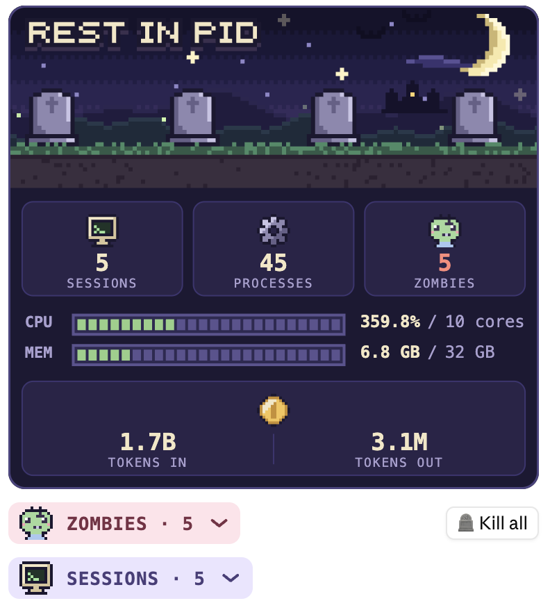
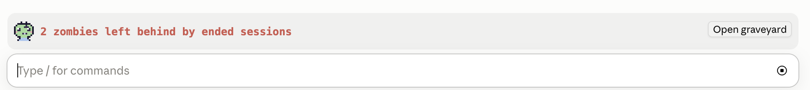

# Rest in PID

A Claude Code mod that keeps a pixel-art graveyard of the processes your
Claude Code sessions and worktrees spawned, and lays their zombies to rest.



Run `/rest-in-pid` to open the board:

- **Status window**: sessions, processes and zombies at a glance; CPU and
  memory as segmented meters against the whole machine; tokens spent.
- **Zombies**: processes whose session is gone, each with a **Kill** button,
  plus **Kill all** (press twice within four seconds to confirm).
- **Sessions**: every running Claude Code session, the worktree it works in,
  its token usage (input with cache reads and writes, and output), and the
  processes it spawned, with CPU and memory for each.

While zombies exist, a band above the prompt counts them and opens the
board, and a toast announces each new one.



## What counts as a zombie

A process belongs to a live session when it descends from that session's
host process, or when it inherited the host's `CLAUDE_PID` and that host was
already running when it started (a process that reused the pid since starts
later). The session id decides nothing there, since `/clear` gives a running
session a new one. An MCP server inherits `CLAUDE_CODE_SESSION_ID` alone, so
it belongs to the running session holding that id. It is a zombie when:

- **session ended**: the session it inherited has no running host any more
  (the pid is gone or was reused, or no running session holds the id), or
  it is a Bash tool shell still sourcing a shell snapshot its session
  deleted (Claude Code deletes a session's snapshot when the session exits);
- **no live session**: neither it nor anything in its tree or its Bash
  command says which session started it, it sits in a
  `.claude/worktrees/<name>` folder, and no running session works there or
  in that repository's main checkout;
- **worktree deleted**: nothing says which session started it, as above, and
  the worktree folder it sits in no longer exists.

What a live session runs inside, such as its terminal, a tmux server or an
editor, is never a zombie, even when a session that has since ended started
it. Nor are the OS's and apps' own binaries, apart from the toolchains kept
among them: JDKs under `/Library/Java`, Xcode's developer tools, and
`/usr/lib/jvm` on Linux.

Claude Code's retention sweep deletes shell snapshots older than
`cleanupPeriodDays` (30 by default) whether their session still runs or
not, so only a younger snapshot's absence counts.

macOS hides the environment of its own binaries (`/bin/zsh`, `/usr/bin/tail`
and the like), so a process with no evidence of its own follows its process
group: each Bash tool command runs in a group of its own, and a member goes
with a sibling that is a zombie, unless the group also holds something live
or not yours. Linux shows every process's environment in `/proc`, so there
this matters less. Only an orphan, alone or under other leftovers, can be a
zombie: one launchd adopted on macOS, or init or the user's systemd on Linux.
A shell in your own terminal or editor never is.

What it cannot see: a lone macOS binary whose session left no other trace,
such as `sleep 600 &` with no sibling; a shell loop from a session that
crashed, since a crash leaves the snapshot behind; and such traceless
leftovers in a worktree while a session runs in that repository's main
checkout, since that session may well have started them.

Its descendants are part of its tree, and every process in it counts. A
`<defunct>` (Unix zombie) process counts too but is never signalled: it is
already dead, and goes once its parent does.

Live sessions come from `sessions/<pid>.json` in Claude Code's folder
(`~/.claude`, or `CLAUDE_CONFIG_DIR` when it is set). An entry vouches for
its pid only while the process start time matches, so a reused pid never
revives a dead session. A Claude Code process with no entry still counts as
live, so its children are never mistaken for orphans.

## What Kill does

1. Scans again, so each chosen tree is taken as it runs now: with the
   children it spawned since the board was drawn, and without anything
   that has since come to life, such as a shell a new session started in.
2. Re-reads `ps` and keeps only the pids that still have the same start
   time and command, belong to you, and are not a session host or this
   session.
3. Sends `SIGTERM` to the tree, deepest processes first.
4. Two seconds later, scans again and sends `SIGKILL`, after the same
   check, to whatever survived and to anything that rose meanwhile in a
   process group it signalled, such as a child a dying process spawned.

Docker containers are not host processes and are out of scope.

## What it runs and reads

Everything stays on your machine: the mod makes no network requests.

- **Runs** `ps` for the process list, `lsof` for a leftover's working folder,
  `sysctl` for the core count and memory, `/bin/sh` with `id` and `uname`
  for its own session, user and system, `find`, `dd` and `head` to read
  session transcripts from where the last scan stopped, and `kill` only when
  you press Kill. On Linux, `/bin/sh` with `tr` and `readlink` reads
  `/proc/<pid>/environ` and `/proc/<pid>/cwd` in place of `ps eww` and
  `lsof`, and `getconf` with `/proc/meminfo` stands in for `sysctl`.
- **Reads** `sessions/*.json` in Claude Code's folder for the running
  sessions, and each session's transcript under its `projects`, keeping
  only the token usage of each response. From Claude Code's settings it
  reads `cleanupPeriodDays` alone. For processes outside every live session
  it reads the environment, keeping only `CLAUDE_PID` and
  `CLAUDE_CODE_SESSION_ID`, and checks whether their worktree folder or
  shell snapshot still exists.

## Install

Run these two commands in a terminal (your shell, not a Claude Code prompt):

```bash
claude plugin marketplace add jwchang0206/rest-in-pid
claude plugin install rest-in-pid@jwchang0206
```

The plugin then loads in Claude Code in the terminal and in the Code tab of
the Desktop app, which read the same settings. Start a new session, or run
`/reload-plugins` in one that was already open.
A new release arrives once the `version` in `plugin.json` goes up
([CHANGES.md](CHANGES.md) says what each one changed). To take it:

```bash
claude plugin marketplace update jwchang0206
claude plugin update rest-in-pid@jwchang0206
```

Mods need Claude Code 2.1.287 or later in the terminal, or 2.1.286 in the Desktop app.

Runs on macOS and Linux, not Windows. On Linux it needs the procps `ps`
(busybox's lacks the columns), and CPU is each process's average since it
started, which is what procps reports, rather than the last few seconds.

For one session from a checkout: `claude --plugin-dir ./rest-in-pid`.

## Develop

```bash
claude plugin validate .
claude plugin test .
```

`hooks/model.ts` holds the parsing and classification as pure functions, which
`tests/model.test.ts` covers. `tests/scan.test.ts` checks how a scan reads
transcripts and remembers environments, and `tests/pane.test.tsx` drives the
whole mod with fake `ps` output on the terminal and desktop surfaces.

## License

[MIT](LICENSE)
